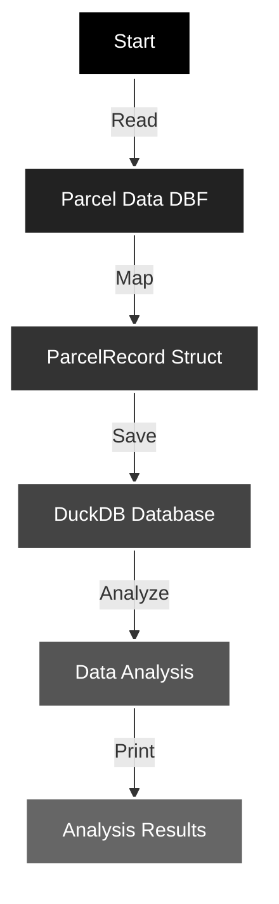

# rust-real-e

Processing parcel data with Rust and DuckDB.

### Quickstart

```shell
cargo run
```



## What it does

`rust-real-e` reads parcel data from a DBF file, maps it into Rust structs, saves it into a DuckDB database, and performs some basic data analysis. But why...? **Because we can**.


```shell
Getting names with most parcels

 Owner                                  | Parcel Count 
----------------------------------------+--------------
 RIVER BEND MEMBERSHIP CORP             | 17879 
 Unknown                                | 12882 
 OVERLAY I LLC                          | 4541 
 PANHANDLE HOMES OF BERKELEY COUNTY INC | 4370 
 LGI HOMES-WEST VIRGINIA LLC            | 3154 
 DRB GROUP WEST VIRGINIA LLC            | 2964 
 DHIR-CAPITAL I LLC                     | 2774 


Get the top owners by total appraised value

 Owner                                         | Total Appraised Value 
-----------------------------------------------+-----------------------
 WEST VIRGINIA ECONOMIC DEVELOPMENT AUTHORITY  | 9082209000.00 
 UNITED STATES OF AMERICA                      | 4861807400.00 
 BERKELEY COUNTY BOARD OF EDUCATION            | 3980912300.00 
 BOARD OF EDUCATION OF BERKELEY COUNTY         | 1882309100.00 
 BERKELEY COUNTY PUBLIC SERVICE SEWER DISTRICT | 1476898500.00 
 CITY HOSPITAL FOUNDATION INC                  | 1248360800.00 
 TABLER STATION LLC                            | 1108746900.00 

```
## How it works

1. **Data Reading**: The program reads a `.dbf` file containing parcel data using the `dbase` crate.

2. **Data Mapping**: Each record is mapped to a `ParcelRecord` struct defined in `src/parcel_record.rs`.

3. **Saving to DuckDB**: The records are saved into a DuckDB database (`parcel_data.db`) using the `duckdb` crate.

4. **Data Analysis**: DuckDB is then used to perform SQL-based analysis on the imported parcel data. This allows for quick aggregation, filtering, and transformation of the data directly in the database without needing to move data to an external analysis tool. With DuckDB's efficient in-memory processing, complex analytical queries run fast, making it ideal for examining patterns, trends, and insights in parcel data.

## Quick Start

1. **Clone the Repository**:
```shell
git clone https://github.com/geoffsee/rust-real-e.git
```
2. **Navigate to the Project**:
```shell
cd rust-real-e
```
3. **Run the Program**:
```shell
cargo run
```

   Make sure you have Rust installed.

## Extending

Add your own data analysis functions in `src/db.rs`. Follow the existing pattern or something better.

Example:

```rust
pub fn get_parcels_by_year_built(year: f64) -> Result<(), Box<dyn std::error::Error>> {
    // Your code here
}
```

## Project Structure

- `src/main.rs`: Entry point and orchestrates the data processing and analysis.
- `src/dbf.rs`: Reads DBF files containing parcel data.
- `src/data_mapper.rs`: Maps DBF records to `ParcelRecord` structs.
- `src/db.rs`: Functions for saving to and querying the DuckDB database.
- `src/parcel_record.rs`: Definition of the `ParcelRecord` struct.
- `src/pretty_print.rs`: Utility functions for pretty-printing tables.

## Contributing

If you must. Send a PR. Make it good.

## License

MIT © 2024 Geoff Seemueller